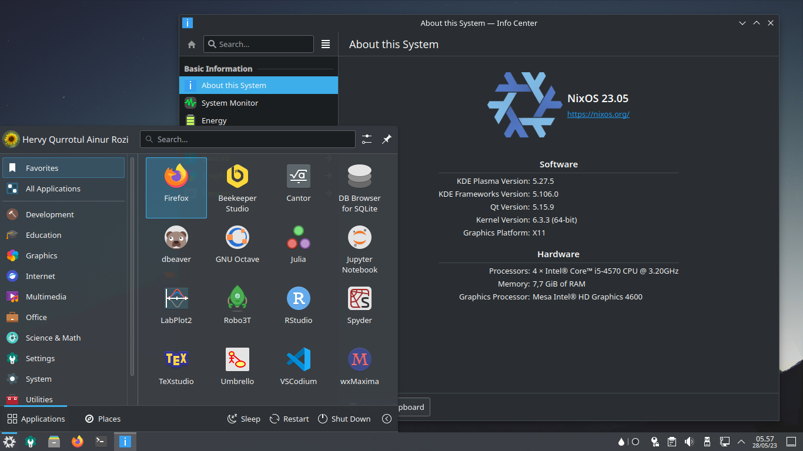

# NixOS for Data Science



Configuration of Nixos operating system with KDE Plasma (disk
encrypted) for Data Science and Hobbyist.

## Installation

1. Cloning.

    ```sh
    git clone git@gitlab.com:hervyqa/dotfire.git
    cd dotfire
    ```

2. Symlink.

    ```sh
    sudo mv /etc/configuration.nix /etc/configuration.nix.backup
    sudo ln -s $PWD/configuration.nix /etc/nixos/
    ```

## Variable

```plain
name = "hervyqa";
fullname = "Hervy Qurrotul Ainur Rozi";
email = "hervyqa@proton.me";
timezone = "Asia/Jakarta";
defaultlocale = "en_US.UTF-8";
extralocale = "id_ID.UTF-8";
layout = "us";
gpgkey = "C10684E03E228DC0";
hostname = "nixos";
version = "24.05";
```

Replace the variables above according to your data in directory:

1. packages:
  - `git`
2. system:
  - `locale`
  - `network`
  - `nix`
  - `security`
  - `system`
  - `timezone`
  - `users`
3. services:
  - `xserver`

## Settings

### Hardware

Hardware | Enable | Description
:------------ | :---------- | :----------
`driSupport` | `true` | Enable accelerated OpenGL rendering through the Direct Rendering Interface (DRI).
`driSupport32Bit` | `true` | On 64-bit systems, whether to support Direct Rendering for 32-bit applications.
`plymouth` | `false` | Enable Plymouth boot splash screen.
`sane` | `false` | Enable support for SANE scanners.
`brscan4` | `false` | Automatically register the "brscan4" sane backend and bring configuration files to their expected location.

### Programs

Programs | Enable | Description
:------------ | :---------- | :----------
`adb` | `true` | Whether to configure system to use Android Debug Bridge (adb).
`command-not-found` | `true` | Whether interactive shells should show which Nix package (if any) provides a missing command.
`dconf` | `true` | Enable dconf.
`fish` | `true` | Whether to configure fish as an interactive shell.
`git` | `true` | Enable git.
`gnupg.agent` | `true` | Enables GnuPG agent with socket-activation for every user session.
`java` | `true` | Install and setup the Java development kit.
`kdeconnect` | `true` | Enable kdeconnect.
`mtr` | `true` | Whether to add mtr to the global environment and configure a setcap wrapper for it.
`partition-manager` | `true` | Enable KDE Partition Manager.
`corectrl` | `false` | Enable A tool to overclock amd graphics cards and processors.
`droidcam` | `false` | Enable DroidCam client.
`firefox` | `false` | Enable the Firefox web browser.
`gamemode` | `false` | Enable GameMode to optimise system performance on demand.
`htop` | `false` | Enable htop process monitor.
`steam` | `false` | Enable steam.
`tmux` | `false` | Whenever to configure tmux system-wide.

### Services

Service | Enable | Description
:------------ | :---------- | :----------
`dnscrypt-proxy2` | `true` | Enable dnscrypt-proxy2.
`earlyoom` | `true` | Enable Early out of memory killing.
`espanso` | `true` | Enable Espanso.
`fstrim` | `true` | Enable periodic SSD TRIM of mounted partitions in background.
`jupyter` | `true` | Enable Jupyter development server.
`mysql` | `true` | Enable MySQL server (MariaDB).
`pipewire` | `true` | Enable pipewire service.
`postgresql` | `true` | Enable PostgreSQL Server.
`power-profiles-daemon` | `true` | DBus daemon that allows changing system behavior based upon user-selected power profiles.
`printing` | `true` | Enable printing support through the CUPS daemon.
`redis` | `true` | An open source, advanced key-value store.
`sddm` | `true` | Enable sddm as the display manager.
`udev` | `true` | Enable udev.
`udisks2` | `true` | DBus service that allows applications to query and manipulate storage devices.
`xserver` | `true` | Enable the X server.
`avahi` | `false` | Allows Avahi clients to use Avahi's service discovery facilities.
`colord` | `false` | Enable colord, the color management daemon.
`clamav` | `false` | Antivirus engine designed for detecting Trojans, viruses, malware and other malicious threats.
`clickhouse` | `false` | Enable ClickHouse database server.
`grafana` | `false` | Enable grafana.
`hdapsd` | `false` | Enable Hard Drive Active Protection System Daemon by udev and systemd.
`mongodb` | `false` | Enable MongoDB Server.
`metabase` | `false` | Enable Metabase service.
`openssh` | `false` | OpenSSH secure shell daemon, which allows secure remote logins.
`thermald` | `false` | Enable thermald, the temperature management daemon.
`tlp` | `false` | Enable the TLP power management daemon.

### System

System | Enable | Description
:------------ | :---------- | :----------
`allowUnfree` | `true` | The configuration of the Nix Packages collection to allow unfree packages.
`auto-optimise-store` | `true` | Replaces files in the store that have identical contents with hard links to a single copy.
`bluetooth` | `true` | Enable support for Bluetooth.
`doas` | `true` | Enable the doas command, which allows non-root users to execute commands as root.
`firewall` | `true` | This is a simple stateful firewall that blocks connection attempts to unauthorised TCP or UDP ports on this machine.
`networkmanager` | `true` | Obtain an IP address and other configuration for all network interfaces that are not manually configured.
`nix.gc.automatic` | `true` | Automatically run the garbage collector at a specific time.
`nix.optimise` | `true` | Automatically run the nix store optimiser at a specific time.
`powerManagement` | `true` | Enable power management. This includes support for suspend-to-RAM and powersave features on laptops.
`rtkit` | `true` | Enable the RealtimeKit system service, which hands out realtime scheduling priority to user processes on demand.
`systemd-boot` | `true` | Enable the systemd-boot (formerly gummiboot) EFI boot manager.
`xdg.mime` | `true` | Whether to install files to support the XDG Shared MIME-info specification and the XDG MIME Applications specification.
`zramSwap` | `true` | Enable in-memory compressed devices and swap space provided by the zram kernel module.
`allowReboot` | `false` | Reboot the system into the new generation instead of a switch.
`autoUpgrade` | `false` | Whether to periodically upgrade NixOS to the latest version.
`documentation.doc` | `false` | Whether to install documentation distributed in packages' /share/doc.
`documentation.info` | `false` | Whether to install info pages and the info command. This also includes "info" outputs.
`documentation.nixos` | `false` | Whether to install NixOS's own documentation.
`iwd` | `false` | Enable iwd.
`oomd` | `false` | Whether to disable the systemd-oomd OOM killer.
`pulseaudio` | `false` | Enable the PulseAudio sound server.
`sudo` | `false` | Enable the sudo command, which allows non-root users to execute commands as root.
`useOSProber` | `false` | If set to true, append entries for other OSs detected by os-prober.
`xdg.portal.lxqt` | `false` | Enable the desktop portal for the LXQt desktop environment.
`xdg.portal.wlr` | `false` | Enable desktop portal for wlroots-based desktops.

### Virtualisation

Virtualisation | Enable | Description
:------------ | :---------- | :----------
`docker` | `false` | This option enables docker, a daemon that manages linux containers.

## Open Source Data Science

### RStudio for R

[RStudio](https://posit.co/products/open-source/rstudio/) is an integrated
development environment (IDE) for R and Python. It includes a console,
syntax-highlighting editor that supports direct code execution, and tools for
plotting, history, debugging, and workspace management. RStudio is available
in open source and commercial editions and runs on the desktop (Windows, Mac,
and Linux).

### Spyder IDE for Python

[Spyder IDE](https://www.spyder-ide.org) is a free and open source
scientific environment written in Python, for Python, and designed by and for
scientists, engineers and data analysts. It features a unique combination of the
advanced editing, analysis, debugging, and profiling functionality of a
comprehensive development tool with the data exploration, interactive execution,
deep inspection, and beautiful visualization capabilities of a scientific
package.

### VSCodium

The [VSCodium](https://vscodium.com) Free/Libre Open Source Software Binaries
of VS Code. VSCodium is a community-driven, freely-licensed binary distribution
of Microsoft’s editor VS Code. Telemetry is disabled.

### JupyterLab

[JupyterLab](https://jupyter.org) is the latest web-based interactive
development environment for notebooks, code, and data. Its flexible interface
allows users to configure and arrange workflows in data science, scientific
computing, computational journalism, and machine learning.

### DBeaver for Database

[DBeaver](https://dbeaver.io) Free multi-platform database tool for developers,
database administrators, analysts and all people who need to work with
databases. Supports all popular databases: MySQL, PostgreSQL, SQLite, Oracle,
DB2, SQL Server, Sybase, MS Access, Teradata, Firebird, Apache Hive, Phoenix,
Presto, etc.

### SQLite Browser

[DB Browser for SQLite (DB4S)](https://sqlitebrowser.org) is a high quality,
visual, open source tool to create, design, and edit database files compatible
with SQLite.

### GNU Octave

[GNU Octave](https://octave.org/index) The Octave syntax is largely compatible
with Matlab. The Octave interpreter can be run in GUI mode, as a console, or
invoked as part of a shell script.

### Clickhouse

[Clickhouse](https://clickhouse.com/) Column-oriented databases are better
suited to OLAP scenarios. They are at least 100x faster in processing most
queries. ClickHouse uses all available system resources to their full potential
to process each analytical query as fast as possible.

### SageMath

[SageMath](https://www.sagemath.org/) is a free open-source mathematics
software system licensed under the GPL. It builds on top of many existing
open-source packages: NumPy, SciPy, matplotlib, Sympy, GAP, FLINT, R
and many more. Access their combined power through a common, Python-based
language or directly via interfaces or wrappers. The Mission: Creating a viable
free open source alternative to Magma, Maple, Mathematica and Matlab.

### ROOT Data Analysis Framework

[The ROOT](https://root.cern.ch/) system provides a set of OO frameworks with
all the functionality needed to handle and analyze large amounts of data in a
very efficient way. Having the data defined as a set of objects, specialized
storage methods are used to get direct access to the separate attributes of
the selected objects, without having to touch the bulk of the data.

### Metabase

[Metabase](https://metabase.com/) is an open-source business intelligence
platform. You can use Metabase to ask questions about your data, or embed
Metabase in your app to let your customers explore their data on their own.

### Grafana

[Grafana](https://grafana.com/) is the open and composable observability and
data visualization platform. Visualize metrics, logs, and traces from multiple
sources like Prometheus, Loki, Elasticsearch, InfluxDB, Postgres and many more.

### Helix Editor

[Helix Editor](https://helix-editor.com) A zero config post-modern CLI
text editor similiar VIM or Neovim.

### Texstudio

[Texstudio](https://www.texstudio.org/) is an integrated writing environment
for creating LaTeX documents. The goal is to make writing LaTeX as easy and
comfortable as possible. Therefore TeXstudio has numerous features like
syntax-highlighting, integrated viewer, reference checking, and various
assistants.

### CLI tools

* `dvc` Version Control System for Machine Learning Projects.
* `gnuplot` Portable command-line driven graphing utility for many platforms.
* `kaggle` Official API for [Kaggle](https://www.kaggle.com).
* `luigi` Python package that helps you build complex pipelines of batch jobs.
* `root` A data analysis framework.
* `visidata` Interactive terminal multitool for tabular data.

### Programming Languages

In addition to `rstudio` (R) and `python`, there are also `lua`, `julia`,
`sage`, `root`, `latex` and `scala`.

### Art & Multimedia

Sometimes i am work to make visualisations, infographics, edit photo, short
videos, and other works or hobby of art. I need to install from `graphic`,
and `media` directory. Maybe you need to comment these packages.

## License

MIT License

Copyright (c) 2023 Hervy Qurrotul Ainur Rozi
